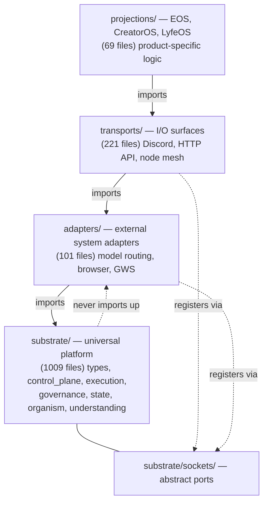
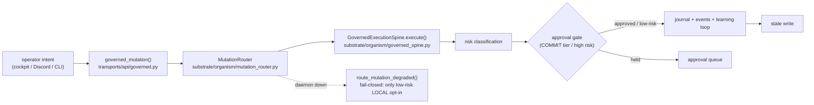
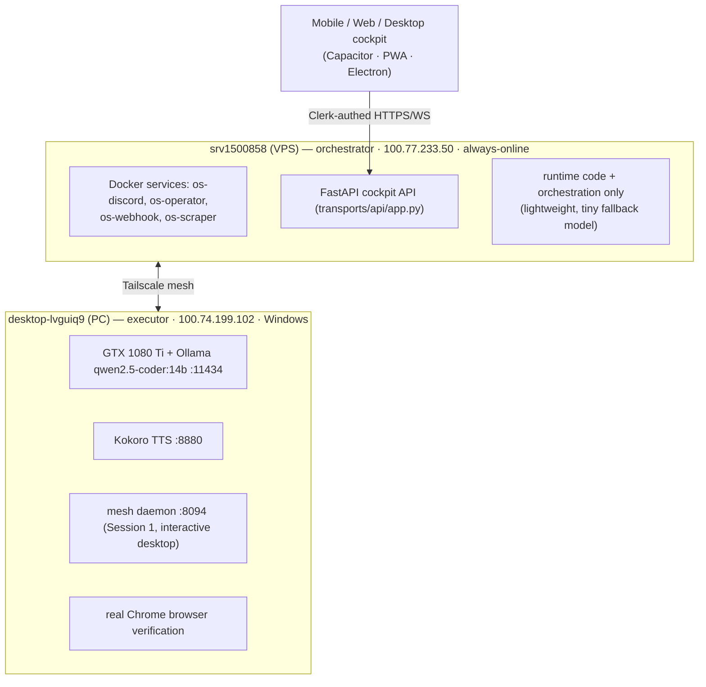

# UMH Architecture — the definitive map

UMH (Universal Meta Harness) is a **governed intelligence substrate**: a universal
platform that turns operator intent into governed, traced state mutations and
AI-enhanced execution. It is not an application. Applications — called
**projections** (EntrepreneurOS/EOS, CreatorOS, LyfeOS) — are built *on top of*
the substrate and consume its contracts. Everything universal lives in
`substrate/`; everything instance- or product-specific lives above it.

Two ideas govern every decision in the tree:

- **Deterministic-first.** The deterministic layer is the spine — it always
  works. AI is a cognitive enhancement, never a dependency. Every LLM call has a
  deterministic fallback that produces a usable result. Test: "all LLM providers
  are down — does the system still produce output?" must be *yes*.
- **Governed mutation.** Every state change routes through one canonical path so
  that risk classification, journaling, approval gates, and the learning loop
  apply uniformly. There is no ungoverned write path.

Source of truth for this page: `/opt/OS/ARCHITECTURE.md`, `PLATFORM_SPEC.md`,
`PROTOCOLS.md`, `substrate/organism/canonical_runtime.py`, and the
`.claude/rules/*.md` laws. Directory counts come from the wiki manifest.

---

## The four code layers (dependency law)

UMH has four code layers with a **strict one-way-downward** dependency direction.
A layer may import from layers below it, never above, never sideways between
peers. This is the Architecture Layer Law (`.claude/rules/architecture-layers.md`),
enforced at commit time by `scripts/check_dependency_direction.py`.



When a lower layer needs behavior a higher layer provides (e.g. `substrate/`
needs an intelligence call that physically lives in `adapters/`), the dependency
is **inverted through an abstract port** in `substrate/sockets/` — the lower
layer defines the interface, the higher layer registers an implementation at
runtime. `substrate/sockets/intelligence_port.py` is the canonical example:
substrate code calls `call_with_fallback(...)` against the port, and
`adapters/models/model_router.py` fulfills it.

| Layer | Home | Role | Files |
|---|---|---|---|
| **Projections** | `projections/` | Product logic (EOS agents, workflows, entities). `saas/` is an EOS projection. | 69 |
| **Transports** | `transports/` | I/O surfaces: Discord bot, FastAPI cockpit API (`transports/api/`), the TypeScript platform HTTP server (`transports/api/http/`), node mesh, CLI. | 221 |
| **Adapters** | `adapters/` | Model routing (`model_router.py`), LLM adapters, browser, calendar, capability adapters. | 101 |
| **Substrate** | `substrate/` | Universal platform: types, control_plane, execution, governance, state, organism, understanding, sockets. | 1009 |

The hard invariant, repeated in every law file: **`substrate/` never imports from
`transports/` or `services/`.** If uncertain which layer a new file belongs to,
it is probably substrate.

---

## The four ontology layers (knowledge/metamodel law)

Distinct from the *code* layers is the **ontology** stack — how knowledge is
separated so one projection's domain never contaminates the universal platform.
This is the Ontology / Metamodel Layer Law (`.claude/rules/ontology-layers.md`),
enforced by `scripts/check_ontology_layers.py` (Gate 13) and
`scripts/check_ontology_homes.py`.

| Layer | Meaning | Home |
|---|---|---|
| **L1 — External Operational Reality Model** | The real world the org operates in: external entities, observed truth. | `substrate/reality_model/`; `substrate/organism/reality_graph.py` (graph view — reflects, never initiates) |
| **L2 — UMH Platform Metamodel** | The universal type system every projection reuses: Signal, Operation, WorkPacket, RiskClass, PermissionTier, the ontology laws. | `substrate/types.py`, `substrate/ontology/` |
| **L3 — Projection Domain Models** | Application-specific domain objects and vocabulary (EOS Venture/BIS, CreatorOS content, LyfeOS life-domains). | `projections/<name>/`; `substrate/understanding/domains/<name>.py` bridges |
| **L4 — Semantic Grounding / bridge** | Maps external reality ↔ projection domain ↔ metamodel. | `substrate/understanding/domains/contract.py`, `registry.py`; `substrate/reality_model/canonical_reality_write.py` |

The core question before adding any class to `substrate/types.py` or
`substrate/ontology/`: **would a different projection model this differently? If
yes, it is L3 and belongs in `projections/`, not L2.** A field like `stage_name`,
`venture`, `offer`, `icp`, or `north_star` is EOS vocabulary (L3 contamination in
L2). The Instance Context Law (`.claude/rules/instance-context.md`) and Projection
Boundary Law (`.claude/rules/projection-boundary.md`) enforce the string-literal
and identifier corollaries of the same principle.

---

## Two execution spines — do not conflate them

UMH has multiple pipelines named "spine." **Two are commonly confused, and they
are not the same thing.**

### 1. The canonical operation runtime (all state mutations)

The single declared path from operator intent to a governed state mutation, named
once in `substrate/organism/canonical_runtime.py`:

```
governed_mutation  →  MutationRouter  →  GovernedExecutionSpine
```

- `governed_mutation()` (`transports/api/governed.py`) is the public entry. It
  lives in `transports/` because it obtains the organism daemon singleton at call
  time — a transport concern — but holds no execution logic.
- `MutationRouter` (`substrate/organism/mutation_router.py`) routes the request,
  applies risk classification, and enforces the fail-closed contract.
- `GovernedExecutionSpine` (`substrate/organism/governed_spine.py`, 889 lines) is
  the mutation gateway proper: risk classification, journaling, event
  propagation, approval gates, and the learning loop. **All state writes route
  through its `execute()`.**

`canonical_runtime.py` itself holds no execution logic — it is a *declaration*
plus a deterministic routing flag (`UMH_CANONICAL_RUNTIME_ROUTING`, off by
default). Rival runtimes (`GovernedWorkRuntime`, `CommandRuntime`, `OrganismLoop`)
are **adapters** that submit their mutation step into this path when routing is
enabled — they are not second choke points. The invariant is held by
`tests/test_single_spine_architecture.py`.



If the organism daemon is unavailable, `governed_mutation()` does **not** execute
directly — it delegates to `route_mutation_degraded()`, which rejects any
non-LOW-risk or non-opted-in mutation with a 503-equivalent result and no state
change. There is no ungoverned execution path. The
`scripts/check_ungoverned_mutations.py` gate blocks any new POST/PUT/PATCH/DELETE
handler in `transports/api/` that does not route through `governed_mutation()`
(Python) or `governedMutation()` (TypeScript).

### 2. The LLM cognitive spine (intelligence, not mutation)

`substrate/execution/spine.py` (`ConcreteExecutionSpine`, 546 lines) is a separate
**8-stage deterministic-first cognitive pipeline** —
interpret → recall → lookup → compose → route → execute → trace → feedback. It
processes intelligence requests (an operator asking a question, an agent
reasoning). It is **not** the canonical mutation runtime and never authors state
writes. `ARCHITECTURE.md` §6 lists a third, `ExecutionPipeline`
(`substrate/execution/pipeline.py`, 557 lines) for signal/read processing.

**Rule of thumb:** state change → canonical operation runtime (`governed_spine`);
thinking/answering → cognitive spine (`execution/spine.py`).

---

## Platform freeze and roadmap

`PLATFORM_SPEC.md` is **v1.0.0, Status: FROZEN** (certified production-ready
2026-07-01). Frozen means the published contracts do not change casually — future
work either extends the platform through those contracts or goes through the
**Breaking Change Process** (RFC + migration + regression qualification) defined
at the top of the spec. The spec tracks SLOs (mesh reliability ≥ 99%, session
availability ≥ 95%, dispatch success ≥ 95%, p95 latency < 10000 ms) that must be
preserved across changes.

The roadmap extends the frozen platform in three phases:

- **P1 — Core Operator Workflows:** daily workflows (research, coding, planning,
  execution, communication, review) through the existing governed mutation
  contracts.
- **P2 — Capability Expansion:** new governed capabilities (GitHub, Figma, browser
  tasks, document generation, Slack) through existing platform contracts.
- **P3 — Productization:** operator experiences and customer-facing products.

Permanent constraints (from `CLAUDE.md`): all state changes through
`governed_mutation()`; all execution through the canonical spine; Docker is Python
3.11 only; `substrate/` never imports from `transports/`/`services/`; type
coherence checked against `substrate/canonical_types.py`; ORL-8 and runtime SLOs
preserved.

---

## Enforcement stack

Architecture is not aspirational here — it is mechanically enforced. Two families
of gates hold the line.

### Pre-commit code gates (`scripts/check_*.py`)

Sixteen gate scripts run at commit time:

| Gate script | Enforces |
|---|---|
| `check_dependency_direction.py` | 4-layer one-way-down import direction |
| `check_projection_leak.py` | no projection identifiers in `substrate/` |
| `check_instance_leak.py` | no instance/tenant literals in `substrate/` |
| `check_ontology_layers.py` | L2 metamodel free of L3 domain contamination |
| `check_ontology_homes.py` | frozen set of ontology/reality/domain homes (Gate 13) |
| `check_type_divergence.py` | no parallel type systems vs `canonical_types.py` |
| `check_ungoverned_mutations.py` | every write handler routes through `governed_mutation()` |
| `check_cpu_gate.py` | no raw subprocess in gated dirs (CPU Gate Law, Gate 5) |
| `check_credential_injection.py` | no plaintext secrets in subprocess/SSH calls |
| `check_secret_patterns.py` | no committed secrets/tokens |
| `check_mesh_relay_firewall.py` | mesh relay boundary integrity |
| `check_projection_registry_reads.py` | projection state read via canonical port only |
| `check_skill_staleness.py` | tool skills current, not stale |
| `check_voice_runtime_divergence.py` | voice diag beacon wired; known-hang not awaited (Gate 14) |
| `check_pytest_collection.py` | test suite collects cleanly |
| `check_stop_condition.py` | Stop-hook auto-report integrity |

### The 6-layer CPU defense (CPU Gate Law)

UMH must never saturate CPU on any host (a runaway process once got the VPS CPU
throttled for a week). The single choke point is
`substrate/execution/cpu_gate.py`; all heavy work goes through
`gated_subprocess_run()` / `gated_popen()`, which return `None` when CPU is
overloaded. Six layers stack innermost → outermost: (1) substrate `cpu_gate`
(1.8/core ceiling), (2) `cc_sdk` gate (1.5/core for CLI subprocess), (3) Docker
CPU caps (0.25–0.35 per container), (4) `cron-run` wrapper (2.0/core + nice +
flock), (5) `watch_graph` (4.0 absolute), (6) systemd watchdog (3.0 SIGSTOP, 4.0
SIGKILL).

---

## Protocol layers (PROTOCOLS.md, L0–L3)

Orthogonal to the code and ontology stacks, UMH layers *behavior* into four
protocol layers so that swapping the underlying model never breaks the system —
the intelligence lives in the layers, not the model (`PROTOCOLS.md`):

```
Layer 0 — AI Identity     substrate/control_plane/identity/ai_identity.py   (universal)
Layer 1 — Platform        substrate/control_plane/runtime/cognitive_loop.py (EOS platform protocols)
Layer 2 — OS Modules      per subscription (TrinityEngine, injected after L1)
Layer 3 — Instance        loaded from the database / BIS at runtime
```

L0 identity and L1 platform protocols are shared substrate; L2 OS-module
protocols are per-subscription; L3 instance context is resolved at runtime from
BIS/env/config (never a literal in code).

---

## Node topology

UMH runs as one organism across nodes with **defined roles** (Node Role
Discipline, `CLAUDE.md`). Roles and identities come from
`infra/device_registry.json` — never hardcoded (Device Naming Protocol,
`.claude/rules/device-naming.md`).



The **VPS is the coordination brain** — lightweight, always-on, runs services and
orchestration, holds no large models. The **Beast is the GPU workhorse** — full
repos, large models, heavy compute, and the *only* node that runs real browser
verification (Browser Verification Law, `.claude/rules/browser-verification.md`:
the orchestrator is headless, so Playwright verification is delegated to an
executor node with an interactive desktop session). Operator surfaces (mobile,
web, desktop) reach the substrate through the Clerk-authenticated cockpit API.

---

## See also

- [Data flow & storage topology](data-flow.md) — end-to-end request traces and where state lives
- [Services & runtime](services-runtime.md) — the running Docker containers and daemons
- [Tech stack](tech-stack.md) — languages, frameworks, dependencies
- [Conventions](conventions.md) — the laws and rules that govern every change
- [`substrate/`](dirs/substrate.md) · [`substrate/organism/`](dirs/substrate-organism.md) · [`transports/`](dirs/transports.md) · [`adapters/`](dirs/adapters.md) · [`projections/`](dirs/projections.md)
- [Health findings](health-findings.md) · [Full audit](audit-2026-07-10.md)
