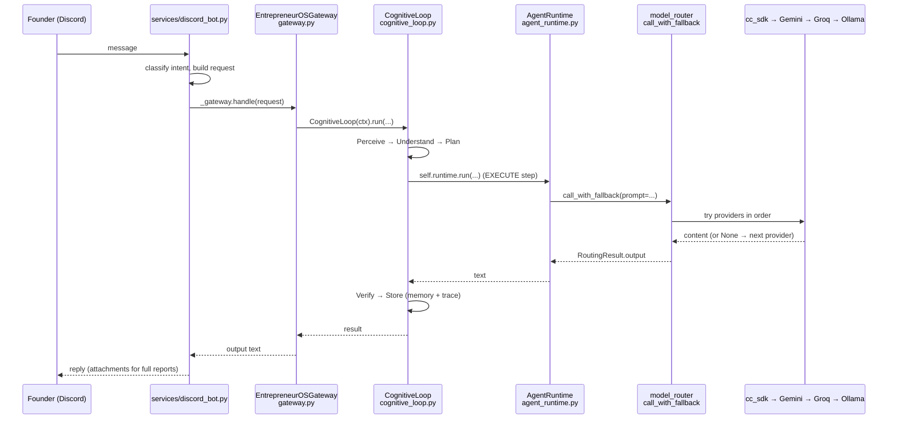

# Data flow & storage topology

This page traces how a request moves through UMH end-to-end, and where state
lives. Every hop below was re-verified against the live tree today (file exists,
line-level call confirmed) rather than trusted from a prior audit — where a flow
could only be confirmed by reading source (not by running it), it is labeled
**static-analysis-only**.

---

## Trace A — Discord message → response

The primary founder interface is the Discord bot (`os-discord` container,
`services/discord_bot.py`, 1915 lines). **Important correction to older
diagrams:** the Discord bot does *not* build a `SignalEnvelope` via
`signal_factory.py`. It routes through `EntrepreneurOSGateway`. The
`SignalEnvelope` factory (`transports/discord/signal_factory.py::message_to_signal`,
75 lines) is consumed by `transports/api/operator.py`, not by the bot — verified
by grep: the only importer of `signal_factory` is `operator.py`.

The actual verified hops:

1. `services/discord_bot.py` receives the message and classifies intent, then
   calls `_run_gateway()` → `transports/presence/handlers/intent_handler.run_gateway`,
   which invokes the module-level singleton `_gateway = EntrepreneurOSGateway()`
   (`discord_bot.py:190`, imported from
   `substrate/control_plane/runtime/gateway.py`).
2. `EntrepreneurOSGateway.handle()` (`gateway.py`, 1946 lines) constructs a
   `CognitiveLoop(ctx)` (`gateway.py:1016`) and calls `loop.run(...)`
   (`gateway.py:1339`). For lightweight paths it can call
   `router.call_with_fallback(...)` directly (`gateway.py:459`, `:894`).
3. `CognitiveLoop.run()` (`substrate/control_plane/runtime/cognitive_loop.py`,
   1740 lines) executes the deterministic-first
   Perceive→Understand→Plan→Execute→Verify→Store loop. Its EXECUTE step calls
   `self.runtime.run(...)` (`cognitive_loop.py:372`, `:802`), where
   `self.runtime` is the `AgentRuntime` obtained via
   `get_agent_runtime()` (`cognitive_loop.py:303`).
4. `AgentRuntime.run()` (`adapters/models/agent_runtime.py`, 580 lines) makes the
   single model call through `model_router.call_with_fallback` (imported at
   `agent_runtime.py:333`). The legacy `AgentRuntime.client` path is deprecated
   in favor of the router.
5. `model_router.call_with_fallback` (`adapters/models/model_router.py`, 1618
   lines) runs the fallback chain: **cc_sdk (Opus 4.8 via subscription CLI) →
   Gemini 2.5 Flash → Groq → Ollama**. `cc_sdk.py` (513 lines) validates output
   against error signatures before returning; auth/quota/transport leaks return
   `None` so the router falls through.
6. The response text propagates back up the same chain to `discord_bot.py`, which
   posts it (full reports as file attachments, never chunked).

Every injection/enhancement step in the loop is caught and logged, never blocks
execution — the deterministic fallback always produces output even with all LLM
providers down. This trace is **static-analysis-verified** (files, imports, and
call sites confirmed); it was not exercised at runtime for this page.

---

## Trace B — Governed mutation (any state write)

Every state change — from any surface — routes through the one canonical
operation runtime. Entry is `governed_mutation()`
(`transports/api/governed.py`, 111 lines). See
[architecture.md](architecture.md#1-the-canonical-operation-runtime-all-state-mutations)
for the declaration.

1. A route handler (e.g. in `transports/api/operator.py:250`, `:278`, `:365`, or
   any `cockpit_*_routes.py`) calls `governed_mutation(mutation_name, intent,
   execute_fn, source, ...)`.
2. `_get_router()` obtains the `MutationRouter` from the running organism daemon
   singleton (`daemon.governed_spine`, `daemon.mutation_registry`). The router is
   cached.
3. `MutationRouter.execute(request)` (`substrate/organism/mutation_router.py`)
   classifies risk, checks the permission tier, and either executes via
   `GovernedExecutionSpine.execute()` (`substrate/organism/governed_spine.py`, 889
   lines) or holds the request in the approval queue (COMMIT-tier / high-risk).
4. On execution: the spine journals the mutation, propagates events, and feeds the
   learning loop. `verification_fn` and `rollback_fn` (if supplied) bound the
   write.
5. **Fail-closed:** if the daemon is down, `governed_mutation()` delegates to
   `route_mutation_degraded(request)`, which rejects any non-LOW-risk or
   non-opted-in mutation with a 503-equivalent result and performs no state
   change. Only a low-risk, LOCAL-blast-radius mutation whose spec sets
   `degraded_mode_allowed=True` may proceed, always with a mandatory audit record.

There is no ungoverned write path — `scripts/check_ungoverned_mutations.py` blocks
any new write handler in `transports/api/` that skips this flow.
Static-analysis-verified.

---

## Trace C — Cockpit (web / desktop / mobile) → substrate

Operator surfaces share one React app (`cockpit/src/renderer/`) rendered by
Electron, the PWA, and Capacitor, and one API. **Two API surfaces exist and must
not be conflated:**

- **FastAPI cockpit API** — `transports/api/app.py` (`app = FastAPI(...)`,
  includes `cockpit_router`, `cockpit_ws_router`, `execution_router`,
  `voice_router`, `workstation_router`, and the large family of
  `transports/api/cockpit_*_routes.py` handlers). Auth is Clerk JWT validation in
  `transports/api/cockpit_auth.py`: it validates `Authorization: Bearer <clerk_jwt>`
  against Clerk's JWKS endpoint (RS256) and is **fail-closed** — rejects all
  requests unless both `CLERK_JWKS_URL` and `ALLOWED_CLERK_USER_IDS` are set.
- **TypeScript platform HTTP server** — `transports/api/http/` (`server.ts`,
  Express-style, Drizzle ORM over Neon, `middleware/auth.ts`, `db/schema.ts`).
  This is UMH platform + EOS multi-tenant infrastructure (users, orgs,
  portfolios, approvals).

The verified cockpit request flow:

1. Cockpit (`cockpit/src/renderer/`) sends **Clerk-authenticated HTTPS/WS**
   requests with a `Bearer <clerk_jwt>` header (mobile raw `fetch()` must include
   `authHeader()` or the request 403s).
2. `cockpit_auth.py` validates the JWT against Clerk JWKS and checks the user ID
   against `ALLOWED_CLERK_USER_IDS` (locked to the founder in the single-user
   phase).
3. Read endpoints return substrate state; **write endpoints call
   `governed_mutation()`** (Trace B), so cockpit writes are governed identically
   to every other surface.
4. WebSocket routes (`cockpit_ws_router`) stream organism/voice/execution state
   back to the client.

Static-analysis-verified (auth module, FastAPI app wiring, and Drizzle schema all
read directly).

---

## Storage topology — where state lives

UMH state is deliberately split across stores by role. Node Role Discipline
(`CLAUDE.md`) forbids duplicating a store onto a node that does not need it.

### Neon Postgres (primary persistent store)

Two independent access paths reach the same Neon instance:

- **Python via `psycopg2`** — the canonical helper is
  `substrate/state/storage/db.py` (`psycopg2.connect(_DATABASE_URL)`,
  `RealDictCursor`), reading/writing `interactions`, `skills`, `ventures`
  (BIS stored as JSON in `ventures.config_json`). Direct `psycopg2` use is
  narrow — only `db.py` and `substrate/state/permissions/os_trinity.py` import it
  directly; other modules go through the `db.py` helper or the storage layer.
  (`portfolio_advisor.py` also opens its own connection.)
- **TypeScript via Drizzle ORM** — `transports/api/http/db/schema.ts` defines the
  platform/EOS tables as `pgTable(...)`: `users`, `portfolios`, `organizations`,
  `org_members`, `user_agent_sessions`, `approvals`, `umh_outcomes`, `embeddings`
  (with a custom `vector` type for semantic memory). `db/client.ts` is the
  connection, `db/migrate.ts` the migration runner.

`ARCHITECTURE.md` §8 documents the broader logical schema (interactions,
embeddings, outcomes, human_profiles, agents, skills, tasks, entity_links,
events, ventures, organizations, approvals, plus the OS-Trinity cross-product
tables). Row counts there are historical and not re-counted for this page.

### JSONL append stores — `data/umh/`

The organism's runtime memory and event history live as append-only JSONL under
`data/umh/`. The busiest set is `data/umh/organism/`:
`events.jsonl`, `execution_journal.jsonl`, `messages.jsonl`,
`outcome_learning.jsonl`, `learning_signals.jsonl`, `deliverables.jsonl`,
`proof_packages.jsonl`, `council_reviews.jsonl`, `dev_sessions.jsonl`, and
per-workcell `heartbeat.json` files. Other subtrees hold their own stores —
`execution_coordinator/`, `fleet/dispatches.jsonl`, `universal_work/`,
`work_portfolio/velocity.jsonl`, `reality_model/instance.jsonl`,
`projections/registrations.jsonl`. Instance identity lives in
`data/umh/instance.json` and `data/umh/ventures.json`; the projection registry
seed in `data/umh/projection_registry.json` (read only via the canonical
projection port, enforced by `check_projection_registry_reads.py`).

### Logs — `logs/`

Runtime logs and audit trails: `audit.log`, `1password_audit.log`,
`bash_commands.log`, `cpu_watchdog.log`, `cc_auth_health.log`,
`cc_session_health.log`, `calendar_invites.log`, and more, plus `logs/archive/`.
Per the Retrieval Hierarchy, logs are the *last* resort for answering questions.

### Vault — `vault/`

`vault/memory/` holds memory candidates and promoted-memory artifacts (the
organism's memory-promotion pipeline), separate from Neon persistence.

### Secrets — 1Password

No secrets live in the repo. All credentials resolve through 1Password
(`op run --env-file=<tpl>` injecting `op://vault/item/field` URIs). The Credential
Injection Law (`.claude/rules/credential-injection.md`) forbids plaintext
credentials in code or CLI args; `scripts/check_credential_injection.py` and
`scripts/check_secret_patterns.py` enforce it at commit time.

### Instance values — `instance.json` / BIS / device registry

Per the Instance Context Law, tenant-specific values are never literals in
`substrate/`. They are resolved at runtime: the AI name via `get_ai_name()`;
founder/company/venture data from the BIS (`ventures.config_json` in Neon +
`data/umh/instance.json`); node identity from `infra/device_registry.json`; infra
hosts and account identifiers from env vars. The founder is "instance 0" — his
values flow through the exact resolution path any future tenant would use, never
hardcoded.

---

## See also

- [Architecture](architecture.md) — the two spines, the four layers, enforcement
- [Services & runtime](services-runtime.md) — the containers and daemons behind these traces
- [`substrate/organism/`](dirs/substrate-organism.md) — the governed mutation runtime home
- [`transports/`](dirs/transports.md) · [`adapters/`](dirs/adapters.md) · [`cockpit/`](dirs/cockpit.md) · [`data/`](dirs/data.md)
- [Health findings](health-findings.md) — including the signal_factory documentation gap
