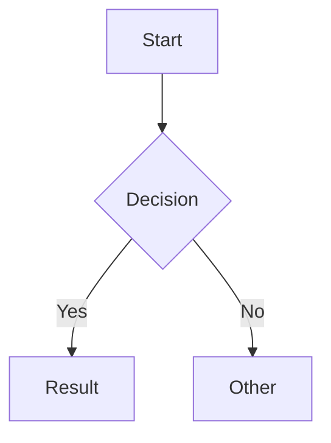

# Obsidian Markdown — Best Practices Reference
Version: 1.0
Last Updated: 2026-04-28
Tool Version: Obsidian 1.8+
Sources: help.obsidian.md, obsidian.md/blog, Obsidian Forum, GitHub obsidianmd/obsidian-releases

---

# Tier 1 — Technical Mastery

---

## Section 1: Authentication / Vault Access Patterns

Obsidian is a local-first application — there is no API key, OAuth flow,
or server-side authentication for reading and writing Markdown files.
Files live on disk. Access is filesystem-level.

**Vault access patterns:**
- A vault is a directory on the local filesystem. Obsidian reads `.md`
  files recursively from the vault root.
- The `.obsidian/` directory inside the vault stores settings, plugins,
  themes, workspace state, and hotkeys. This directory is vault-specific.
- EOS vault path: `/opt/OS/knowledge/`
- Programmatic access: direct file read/write via Python (`open()`,
  `pathlib.Path`). No SDK or client needed.
- Obsidian watches the filesystem for changes. Edits made by external
  tools (scripts, Claude Code) appear in Obsidian within seconds.
- `.obsidian/` should be `.gitignore`'d for shared repos where each
  contributor has different plugin/theme preferences.

**Obsidian Sync authentication:**
- End-to-end encrypted sync requires an Obsidian account.
- Sync uses a proprietary protocol, not Git or rsync.
- EOS does NOT use Obsidian Sync — the vault is on a VPS managed by Git.

**Obsidian Publish authentication:**
- Publish sites can optionally require a password for access control.
- Password-protected sites use a simple shared secret, not per-user auth.

**When running scripts against the vault:**
- No auth headers, tokens, or API keys needed — read/write files directly.
- Respect file locks: Obsidian locks `workspace.json` during active use.
- The vault index is built in-memory by Obsidian; external tools must
  build their own index if they need link resolution.

---

## Section 2: Core Operations

All Obsidian-specific Markdown syntax beyond CommonMark and GFM.

### Internal Links (Wikilinks)

```markdown
[[Note Name]]                          # Link to note by filename
[[Note Name|Display Text]]             # Custom display text
[[Note Name#Heading]]                  # Link to specific heading
[[Note Name#^block-id]]                # Link to specific block
[[#Heading in same note]]              # Same-note heading link
[[Folder/Note Name]]                   # Link with explicit path
```

Obsidian resolves wikilinks by filename, not path. If two notes share a
name in different folders, Obsidian prompts for disambiguation or uses
the "shortest path" setting.

### Embeds

```markdown
![[Note Name]]                         # Embed full note content
![[Note Name#Heading]]                 # Embed section under heading
![[Note Name#^block-id]]               # Embed specific block
![[image.png]]                         # Embed image
![[image.png|300]]                     # Embed image with width (px)
![[image.png|640x480]]                 # Embed image with width x height
![[document.pdf]]                      # Embed PDF (full)
![[document.pdf#page=3]]               # Embed PDF at specific page
![[document.pdf#height=400]]           # Embed PDF with custom height
![[audio.mp3]]                         # Embed audio player
```

### Callouts

```markdown
> [!type] Optional Title
> Content lines prefixed with >

> [!warning]- Collapsed by Default
> Fold indicator: - = collapsed, + = expanded, none = static

> [!question] Outer
> > [!tip] Nested Callout
> > Each nesting level adds another > prefix
```

13 built-in types: `note`, `abstract` (aliases: `summary`, `tldr`),
`info`, `todo`, `tip` (aliases: `hint`, `important`), `success`
(aliases: `check`, `done`), `question` (aliases: `help`, `faq`),
`warning` (aliases: `caution`, `attention`), `failure` (aliases:
`fail`, `missing`), `danger` (alias: `error`), `bug`, `example`,
`quote` (alias: `cite`).

Type matching is case-insensitive. Custom callouts via CSS snippet:

```css
.callout[data-callout="my-type"] {
  --callout-color: 0, 128, 255;
  --callout-icon: lucide-rocket;
}
```

### Properties (YAML Frontmatter)

```yaml
---
title: Note Title
date: 2024-01-15
tags:
  - project
  - active
aliases:
  - Alt Name
cssclasses:
  - wide-page
publish: true
custom_field: any value
---
```

Property types: Text, Number, Checkbox (boolean), Date (YYYY-MM-DD),
Date & Time (YYYY-MM-DDTHH:MM:SS), List (YAML array or inline
`[a, b, c]`), Links (`"[[Note Name]]"` — must be quoted in YAML).

Reserved properties: `tags`, `aliases`, `cssclasses`, `publish`.

### Tags

```markdown
#tag                     # Inline tag
#nested/tag              # Hierarchical tag
#tag-with-dashes         # Hyphens allowed
#tag_with_underscores    # Underscores allowed
```

Valid tag characters: letters (Unicode), digits (not first char),
underscore, hyphen, forward slash. Tags in frontmatter omit the `#`.

### Comments

```markdown
This is visible %%but this is hidden%% in reading view.

%%
Multi-line comment block.
Invisible in reading view and PDF export.
%%
```

### Highlights

```markdown
==highlighted text==
```

Renders with a yellow background in default themes.

### Math (LaTeX via MathJax)

```markdown
Inline: $e^{i\pi} + 1 = 0$

Block:
$$
\int_0^\infty e^{-x^2} dx = \frac{\sqrt{\pi}}{2}
$$
```

### Diagrams (Mermaid)

````markdown

````

To make Mermaid nodes link to Obsidian notes:
```
class NodeName internal-link;
```

### Footnotes

```markdown
Reference-style[^1] and inline^[like this] footnotes.

[^1]: Footnote content here.
```

### Block IDs

```markdown
This paragraph can be linked to. ^my-block-id

- List item 1
- List item 2

^list-block-id
```

Block IDs for paragraphs go on the same line. Block IDs for lists,
quotes, and tables go on a blank line immediately after the block.

### Embedded Search (Query Blocks)

````markdown
```query
tag:#project path:knowledge
```
````

Renders live search results inside the note.

---

## Section 3: Pagination Patterns

**N/A.** Obsidian operates on local files. There are no paginated API
responses. When programmatically listing vault contents, use standard
filesystem pagination patterns (`os.scandir()`, `pathlib.Path.glob()`).

For Dataview queries returning large result sets, use `LIMIT`:
```dataview
TABLE file.mtime AS Modified
FROM "knowledge"
SORT file.mtime DESC
LIMIT 50
```

---

## Section 4: Rate Limits

**N/A.** No API rate limits. File operations are limited only by
filesystem I/O speed. Obsidian Sync has a soft limit of ~10,000 files
per vault and a per-file size limit of 200 MB per file. The sync
queue processes files sequentially but does not throttle read/write.

---

## Section 5: Error Codes and Recovery

Obsidian does not return HTTP error codes. Common failure modes:

| Error | Symptom | Cause | Recovery |
|-------|---------|-------|----------|
| Broken wikilink | Purple/unresolved link text | Target note deleted/renamed without Obsidian tracking | Re-link manually or restore note |
| Invalid frontmatter | Properties panel shows "Invalid" banner | YAML parse error (bad indentation, unquoted special chars, tabs) | Fix YAML — common: missing quotes around values with colons |
| Embed not rendering | Shows `![[...]]` as raw text | Target file missing, wrong extension, unsupported format | Verify file exists; supported: png, jpg, gif, svg, webp, mp3, mp4, pdf, md |
| Mermaid render failure | Shows raw mermaid code | Syntax error in diagram definition | Validate at mermaid.live before pasting |
| Dataview error | Red error block in reading view | Query syntax error or Dataview plugin disabled | Check query syntax; verify plugin enabled |
| Tag not indexed | Tag doesn't appear in tag pane | Tag starts with number or contains invalid char | Rename tag: no leading digits, no spaces, no special chars except `-_/` |
| Callout not rendering | Shows as blockquote without styling | Missing space after `>`, wrong bracket syntax | Must be `> [!type]` with space after `>` and `[!` prefix |
| CSS snippet not loading | Styles not applied | File not in `.obsidian/snippets/` or not enabled | Place `.css` file in snippets dir, enable in Settings > Appearance |
| Plugin conflict | Unexpected behavior, crashes | Two plugins modifying same functionality | Disable plugins one by one to isolate; check console (Ctrl+Shift+I) |

**Frontmatter parse errors — the most common category:**
- Unquoted colons: `title: My Note: A Story` breaks YAML. Use `title: "My Note: A Story"`.
- Tabs instead of spaces: YAML requires spaces for indentation.
- Trailing whitespace after `---`: the closing delimiter must be exactly `---` on its own line.
- Missing space after colon: `title:value` fails. Must be `title: value`.
- Unquoted brackets: `field: [value]` is a YAML list. If you want literal brackets, quote it.

---

## Section 6: SDK Idioms

Obsidian does not have a traditional SDK for external use. The relevant
"SDK" contexts are:

### Obsidian Plugin API (TypeScript)

```typescript
import { Plugin, TFile, TFolder, MarkdownView } from 'obsidian';

export default class MyPlugin extends Plugin {
  async onload() {
    // Access vault
    const files: TFile[] = this.app.vault.getMarkdownFiles();

    // Read file content
    const content = await this.app.vault.read(file);

    // Modify file content
    await this.app.vault.modify(file, newContent);

    // Create file
    await this.app.vault.create('path/to/note.md', content);

    // Get frontmatter
    const cache = this.app.metadataCache.getFileCache(file);
    const frontmatter = cache?.frontmatter;

    // Resolve wikilinks
    const linked = this.app.metadataCache.getFirstLinkpathDest(
      'Note Name', file.path
    );
  }
}
```

Key classes: `App`, `Vault`, `MetadataCache`, `TFile`, `TFolder`,
`TAbstractFile`, `MarkdownView`, `Editor`, `Plugin`, `WorkspaceLeaf`.

### Dataview Query Language (DQL)

```dataview
TABLE tags, file.ctime AS Created
FROM "knowledge/palace/rooms"
WHERE contains(tags, "architecture")
SORT file.mtime DESC
```

```dataview
LIST
FROM [[]] AND -"templates"
SORT file.name ASC
```

Dataview types: `TABLE`, `LIST`, `TASK`, `CALENDAR`.
Inline: `` `= this.field` `` renders a single property value.
DataviewJS: full JavaScript access via `dv` API object.

### Python (External Vault Manipulation)

```python
from pathlib import Path
import yaml

VAULT = Path('/opt/OS/knowledge')

def read_frontmatter(note_path: Path) -> dict:
    """Extract YAML frontmatter from a note."""
    text = note_path.read_text(encoding='utf-8')
    if not text.startswith('---\n'):
        return {}
    end = text.index('\n---\n', 4)
    return yaml.safe_load(text[4:end])

def get_wikilinks(note_path: Path) -> list[str]:
    """Extract all [[wikilinks]] from note content."""
    import re
    text = note_path.read_text(encoding='utf-8')
    return re.findall(r'\[\[([^\]|]+)(?:\|[^\]]+)?\]\]', text)

def find_broken_links(vault: Path) -> list[tuple[str, str]]:
    """Find wikilinks that don't resolve to any file."""
    all_notes = {f.stem: f for f in vault.rglob('*.md')}
    broken = []
    for note in vault.rglob('*.md'):
        for link in get_wikilinks(note):
            target = link.split('#')[0].split('|')[0].strip()
            if target and target not in all_notes:
                broken.append((str(note), target))
    return broken
```

---

## Section 7: Anti-Patterns

### Anti-Pattern 1: Using Markdown links for internal vault links

**Wrong:**
```markdown
See [my note](my-note.md) for details.
See [other note](../folder/other-note.md) for more.
```

**Right:**
```markdown
See [[my note]] for details.
See [[other note]] for more.
```

**Why:** Markdown-style links don't participate in Obsidian's rename
tracking, graph view, or backlink resolution. When you rename a note,
all `[[wikilinks]]` update automatically but `[text](path.md)` links
silently break.

### Anti-Pattern 2: Block IDs on the wrong line for lists

**Wrong:**
```markdown
- Item 1
- Item 2
- Item 3 ^my-list
```

**Right:**
```markdown
- Item 1
- Item 2
- Item 3

^my-list
```

**Why:** Block IDs for multi-line blocks (lists, quotes, tables) must
be on their own line after the block with a blank line separating them.
Placing it inline makes Obsidian treat it as text, not a block ID.

### Anti-Pattern 3: Tags starting with numbers

**Wrong:**
```markdown
#2024-goals
#1st-quarter
```

**Right:**
```markdown
#goals-2024
#q1-quarter
```

**Why:** Tags cannot start with a digit. Obsidian silently ignores them —
the `#` renders as literal text, and the tag never appears in the tag
pane or search.

### Anti-Pattern 4: Unquoted special characters in frontmatter

**Wrong:**
```yaml
---
title: My Note: A Deep Dive
description: Uses [brackets] and {braces}
related: [[Other Note]]
---
```

**Right:**
```yaml
---
title: "My Note: A Deep Dive"
description: "Uses [brackets] and {braces}"
related: "[[Other Note]]"
---
```

**Why:** YAML interprets colons as key-value separators, brackets as
lists, and braces as objects. Unquoted, these break frontmatter parsing
and Obsidian shows an "Invalid properties" error banner.

### Anti-Pattern 5: Callout type without space after >

**Wrong:**
```markdown
>[!warning]
>Missing space after >
```

**Right:**
```markdown
> [!warning]
> Space after > is required
```

**Why:** Without the space, Obsidian renders it as a plain blockquote
instead of a styled callout. The `> ` (angle bracket + space) prefix
is required on every line.

### Anti-Pattern 6: Embedding with wrong prefix

**Wrong:**
```markdown
[[image.png]]          # This creates a link, not an embed
![[image.png|alt=desc]] # Wrong parameter syntax
```

**Right:**
```markdown
![[image.png]]          # The ! prefix triggers embed
![[image.png|300]]      # Pipe for width, not alt text
```

**Why:** Forgetting `!` prefix creates a link instead of an embed.
The pipe parameter in embeds is width (pixels), not alt text. Obsidian
does not support alt text on embedded images in wikilink syntax.

### Anti-Pattern 7: Nested callouts with missing > prefix

**Wrong:**
```markdown
> [!note] Outer
> > [!tip] Inner
> Content still in inner?  ← Actually returns to outer callout
```

**Right:**
```markdown
> [!note] Outer
> > [!tip] Inner
> > Content in inner callout
>
> Content back in outer callout
```

**Why:** Every line of a nested callout needs the correct number of `>`
prefixes. Dropping a `>` level silently moves content to the parent
callout without any error.

---

## Section 8: Data Model

### Vault Structure

```
vault/                         # Root directory = vault
  .obsidian/                   # Settings, plugins, themes
    plugins/                   # Community and core plugins
    themes/                    # CSS themes
    snippets/                  # Custom CSS snippets
    app.json                   # App settings
    appearance.json            # Theme/font settings
    workspace.json             # Open tabs and layout
    hotkeys.json               # Custom keybindings
  folder/                      # Any directory structure
    note.md                    # Markdown note
  attachments/                 # Convention for media files
    image.png
    document.pdf
```

### Entity Types

| Entity | Storage | Identifier | Relationships |
|--------|---------|------------|---------------|
| Note | `.md` file | Filename (stem, no extension) | Links to/from other notes |
| Folder | Directory | Path relative to vault root | Contains notes and subfolders |
| Tag | Inline `#tag` or frontmatter | Tag string | Applied to notes; hierarchical via `/` |
| Link | `[[target]]` in content | Source + target pair | Directed edge in graph |
| Embed | `![[target]]` in content | Source + target pair | Transclusion relationship |
| Attachment | Binary file (png, pdf, etc.) | Filename | Embedded in notes |
| Property | YAML frontmatter field | Key string | Belongs to one note |
| Block ID | `^id` suffix | ID string per note | Enables block-level linking |
| Alias | `aliases` frontmatter | String list | Alternative names for link resolution |

### Graph Model

Obsidian's graph view renders notes as nodes and links as directed edges.
The graph is computed from the MetadataCache, which indexes:
- All wikilinks and their targets
- All tags and their locations
- All headings and their levels
- All frontmatter properties
- All block IDs

The graph is rebuilt on vault load and updated incrementally on file change.
Unresolved links (pointing to non-existent notes) appear as ghost nodes.

### Frontmatter Types System

Obsidian 1.4+ introduced typed properties. Once a property name is used
with a specific type, Obsidian enforces that type across all notes:

- `tags` is always List type
- `aliases` is always List type
- `cssclasses` is always List type
- `publish` is always Checkbox type
- Custom properties: type is inferred from first use, then locked

Property types can be changed globally via Settings > Properties.

---

## Section 9: Webhooks and Events

**N/A.** Obsidian is a desktop application with no webhook system.

For programmatic event detection, options include:
- **Filesystem watchers:** Python `watchdog` library or `inotify` to
  detect file changes in the vault directory.
- **Obsidian Plugin API events:** `vault.on('create')`, `vault.on('modify')`,
  `vault.on('delete')`, `vault.on('rename')` within plugin context.
- **Git hooks:** If the vault is version-controlled, use `post-commit`
  hooks to trigger actions on vault changes.

EOS approach: scripts like `vault_backlink_audit.py` run on-demand or
via cron, not via live event hooks.

---

## Section 10: Limits

| Limit | Value | Source |
|-------|-------|--------|
| Max file size (Sync) | 200 MB per file | Obsidian Sync docs |
| Max vault size (Sync) | 50 GB total | Obsidian Sync docs |
| Max files (Sync) | ~200,000 files | Obsidian Sync practical limit |
| Max note size (rendering) | ~2 MB before noticeable lag | Community benchmarks |
| Max frontmatter properties | No hard limit, ~50 before UI slows | Practical testing |
| Max tags per note | No hard limit | Tags are just text patterns |
| Max nesting depth (callouts) | ~5 levels before readability degrades | Practical limit |
| Max heading level | 6 (`######`) | Markdown spec |
| Max Dataview query results | Defaults to 1000, configurable | Dataview plugin settings |
| Max Canvas file size | ~10 MB before lag | Community benchmarks |
| Max Mermaid diagram nodes | ~100 before render issues | Mermaid.js limitation |
| Filename max length | 255 chars (OS limit) | Filesystem constraint |
| Tag nesting depth | Unlimited (`#a/b/c/d/e`) | No hard limit |
| Max Publish site pages | 10,000 pages | Obsidian Publish docs |

**Note size guidance:** Notes over 50 KB start to show editor lag on
lower-end hardware. Notes over 500 KB should be split. The "atomic note"
philosophy naturally prevents this — most notes are 1-10 KB.

---

## Section 11: Cost Model

| Tier | Price (USD) | Includes |
|------|-------------|----------|
| Personal (free) | $0 | Full app, unlimited vaults, all core plugins, community plugins |
| Obsidian Sync | $4/month (billed annually) | End-to-end encrypted sync, version history (12 months), 10 GB remote storage |
| Obsidian Publish | $8/month (billed annually) | Static site hosting, custom domain, password protection, graph view |
| Commercial use | $50/user/year | Required for 2+ employee companies using Obsidian for work |
| Catalyst (supporter) | $25 one-time (Insider) / $50 (Supporter) / $100 (VIP) | Early access to builds, Catalyst badge |

**Cost for EOS:** $0. The vault is local, sync is via Git, and publishing
is handled by external systems. Commercial license may apply if EOS is
productized with Obsidian as a component (evaluate at Phase 2).

**Sync vs Git cost comparison:**
- Obsidian Sync: $4/month, seamless, end-to-end encrypted, no merge conflicts
- Git: $0 (GitHub free), requires manual commits, merge conflicts possible,
  full version history, works with any CI/CD pipeline

---

## Section 12: Version Pinning

**Obsidian versioning:**
- Obsidian uses semver: major.minor.patch (e.g., 1.8.4)
- The installer version and app version are separate. The installer
  bootstraps the app, which auto-updates independently.
- Desktop: auto-updates enabled by default. Can be disabled in
  Settings > About > "Automatic updates."
- Mobile: updates via app store — follows app store release cadence.

**Current versions (as of 2026-04):**
- Obsidian Desktop: 1.8.x
- Obsidian Mobile: matches desktop version
- Obsidian API: v1.8+ (plugin API follows app version)
- Dataview Plugin: 0.5.x (community plugin, separate versioning)
- Templater Plugin: 2.x (community plugin)

**API stability:**
- Obsidian Plugin API is not fully stable — breaking changes happen
  between major versions. Plugin developers should pin `obsidian`
  dependency in `manifest.json` to a minimum version.
- Core Markdown syntax (wikilinks, callouts, properties, embeds) is
  stable and backward-compatible.
- Frontmatter properties system was introduced in 1.4 — notes from
  older vaults may have untyped properties.

**Deprecations:**
- Legacy `tag:` (singular) frontmatter key — now `tags:` (plural)
- Legacy editor mode (CM5) — fully replaced by CM6 in 1.0
- `cssclass:` (singular) — now `cssclasses:` (plural)

---

# Tier 2 — Creator Intelligence

---

## Section 13: Design Intent and Tradeoffs

**Founders:** Steph Ango (CEO) and Shida Li (CTO), previously at Leanpub.

**Core philosophy: "Your thoughts are yours."**
- Local-first: data lives on your device, not a server
- Plain text: Markdown files, readable without Obsidian
- No lock-in: switch tools anytime, take your data with you
- Extensible: community plugins, not feature bloat in core

**Conscious tradeoffs:**
1. **Local-first over collaboration.** Obsidian chose single-player
   excellence over multiplayer features. Sync exists but real-time
   co-editing does not. This is intentional — the founders believe
   thinking is primarily solo.
2. **Plain text over rich media.** The file format is Markdown.
   Obsidian renders it beautifully but the source is always readable
   in any text editor. This means no proprietary block types, no
   embedded databases (until Bases — see Section 17).
3. **Extensibility over built-in features.** Core Obsidian is lean.
   Kanban, calendars, databases, and automation are community plugins.
   This keeps the core fast and lets the community innovate.
4. **Graph thinking over linear thinking.** Obsidian optimizes for
   linking notes, not filing them. The graph view, backlinks pane,
   and unlinked mentions all reinforce connection over categorization.

**What Obsidian is NOT:**
- Not a real-time collaboration tool (use Google Docs)
- Not a project management tool (use Linear, Notion, or a plugin)
- Not a database (Dataview simulates it, Bases is evolving toward it)
- Not a CMS (Publish is static, not dynamic)

**Steph Ango's "File Over App" philosophy** (published 2023):
Apps are ephemeral. Files are durable. If you want your notes to last,
they should be plain text files, not trapped in a proprietary format.
This directly shaped Obsidian's architecture.

---

## Section 14: Problem-Solution Map and Hidden Capabilities

**Hidden capability 1: Dataview as a live database.**
Most users treat Obsidian as a note-taking app. With Dataview, frontmatter
becomes structured data and queries become live dashboards. Combined with
Templater for automated frontmatter, this creates a lightweight CRM,
task tracker, or inventory system — all in plain text.

**Hidden capability 2: Canvas as a visual programming surface.**
Canvas files (`.canvas`) store nodes and edges as JSON. Each node can
embed a note, image, URL, or freeform text. This makes Canvas a visual
thinking tool, a mood board, a system architecture diagram, and a
presentation tool — all from the same primitive.

**Hidden capability 3: Templater + Dataview for automation.**
Templater can run JavaScript, create files from templates with dynamic
dates/prompts, and insert content programmatically. Combined with
Dataview inline queries, notes can self-populate with computed values.

**Hidden capability 4: Block references as a citation system.**
Block IDs (`^block-id`) + block embeds (`![[Note#^block-id]]`) create
a system where any paragraph in the vault can be cited and transcluded
into any other note. This is how Zettelkasten practitioners build
arguments from atomic claims.

**Hidden capability 5: CSS snippets for per-note styling.**
The `cssclasses` property applies CSS classes to individual notes.
Combined with CSS snippets, you can create radically different layouts
per note type — wide tables, centered reading, minimal headers, custom
colors — without affecting other notes.

**Hidden capability 6: URI scheme for cross-app linking.**
`obsidian://open?vault=MyVault&file=Note%20Name` opens a specific note
from any external app. This enables linking from task managers, browsers,
or scripts directly into Obsidian notes.

---

## Section 15: Operational Behavior and Edge Cases

**Unicode in filenames:**
- Obsidian handles Unicode filenames (CJK, emoji, accented characters)
  correctly on macOS and Linux. Windows has edge cases with long Unicode
  paths exceeding 260 characters.
- Sync between macOS (case-insensitive HFS+) and Linux (case-sensitive ext4)
  can create duplicate files: `Note.md` and `note.md` are the same file
  on macOS but different files on Linux.

**Special characters in filenames:**
- Obsidian prohibits: `* " \ / < > : | ?`
- These characters in wikilinks are silently stripped when creating new notes.
- The `#` character in filenames conflicts with heading link syntax.
  `[[My#Note]]` is ambiguous — is it note `My` heading `Note`, or note `My#Note`?
  Avoid `#` in filenames entirely.

**Conflict resolution (Sync):**
- When Sync detects conflicting edits, it creates a duplicate file
  with a timestamp suffix (e.g., `Note 2024-01-15 143022.md`).
- There is no automatic merge. Manual resolution required.
- Git-based sync (EOS approach) uses standard Git merge, which handles
  line-level conflicts but can produce messy results in frontmatter.

**Frontmatter edge cases:**
- Empty frontmatter (`---\n---\n`) is valid and creates an empty
  properties object.
- Frontmatter with only whitespace between delimiters is also valid.
- Multiple `---` blocks: only the first is treated as frontmatter.
  Subsequent `---` lines are horizontal rules.
- A note starting with `---` followed by invalid YAML will show the
  "Invalid properties" banner but the note remains readable.

**Link resolution order:**
1. Exact filename match (case-insensitive on macOS/Windows)
2. If ambiguous, Obsidian uses "shortest path first" by default
3. Can be changed to "absolute path" in Settings > Files & Links
4. Aliases are checked after filenames

**Performance edge cases:**
- Vaults with 50,000+ notes: startup time increases to 5-10 seconds.
  Graph view becomes unusable without filtering.
- Notes with 1000+ links: editor lag in live preview mode.
- Dataview queries scanning the full vault: can take 2-5 seconds on
  large vaults. Use `FROM "specific/folder"` to scope queries.

---

## Section 16: Ecosystem Position

**Obsidian vs Notion:**
- Obsidian: local-first, Markdown files, single-player, extensible via plugins
- Notion: cloud-first, proprietary blocks, multiplayer, extensible via API
- Choose Obsidian when: data ownership matters, offline access needed,
  deep linking/PKM workflows, developer/power-user audience
- Choose Notion when: team collaboration, non-technical users, embedded
  databases, public pages for stakeholders

**Obsidian vs Logseq:**
- Obsidian: document-first (long notes), wikilinks, YAML frontmatter
- Logseq: outliner-first (bullet-point everything), block references native
- Choose Obsidian when: you think in documents, need rich formatting
- Choose Logseq when: you think in bullets, want block-level granularity
  as the default

**Obsidian vs Roam Research:**
- Obsidian: local files, one-time purchase, unlimited storage
- Roam: cloud-hosted, $15/month subscription, limited storage
- Obsidian won the market: larger community, more plugins, no vendor lock-in
- Roam pioneered bidirectional linking but Obsidian commoditized it

**Obsidian vs Apple Notes / Google Keep:**
- Obsidian: power tool for knowledge workers
- Apple Notes/Keep: capture tool for everyone
- Not competitors — different categories. Use Apple Notes for quick capture,
  Obsidian for knowledge synthesis.

**Where Obsidian fits in a data architecture:**
- **Capture layer:** Quick Capture plugin, Share Sheet (mobile), Inbox folder
- **Processing layer:** Obsidian itself — linking, tagging, restructuring
- **Storage layer:** Local filesystem, Git, Obsidian Sync
- **Publishing layer:** Obsidian Publish, or export to Hugo/Jekyll/Astro
- **Query layer:** Dataview plugin, search, graph view

---

## Section 17: Trajectory and Evolution

**Where Obsidian is heading (2024-2026+):**

1. **Bases (in development).** A native database/spreadsheet feature
   inside Obsidian. Will allow structured data views (table, kanban,
   calendar) directly on vault data without Dataview. This is the most
   significant upcoming feature — it moves Obsidian closer to Notion's
   database capabilities while keeping local-first architecture.

2. **Canvas evolution.** Canvas is getting more node types, better
   connection styling, and potential export formats. Moving toward a
   general-purpose visual thinking tool.

3. **Properties maturation.** The typed properties system (introduced 1.4)
   is becoming the foundation for Bases and structured queries. Expect
   more property types (relation, rollup) in future versions.

4. **Web Clipper improvements.** The official Obsidian Web Clipper extension
   (launched 2024) is actively developed — better extraction, template
   support, variable interpolation.

5. **Publish 2.0.** Obsidian Publish is evolving toward a more capable
   static site host — custom CSS, navigation, and potentially dynamic features.

**De-emphasized / stable:**
- Graph view: feature-complete, unlikely to see major changes
- Core editor: mature CM6 implementation, incremental improvements only
- Sync: stable and reliable, no major changes expected

**Signals to watch:**
- Bases release date — will reshape how structured data works in Obsidian
- Plugin API v2 — potential breaking changes for community plugins
- Mobile parity — mobile app is catching up to desktop feature set

---

## Section 18: Conceptual Model

**The Atomic Note Model:**
Think of each note as an atom — a single idea, claim, concept, or entity.
Notes are small (1-10 KB). The value is not in any single note but in
the connections between them.

**Primitives:**
- **Note** — an atom of knowledge (a single idea in its own file)
- **Link** — a relationship between atoms (`[[wikilink]]`)
- **Tag** — a category label (`#tag`)
- **Property** — structured metadata (frontmatter)
- **Embed** — transclusion of one atom into another (`![[embed]]`)
- **Folder** — physical organization (optional, secondary to links)

**Verbs:**
- **Create** — add a new atom to the vault
- **Link** — connect two atoms with a directed edge
- **Tag** — categorize an atom
- **Embed** — transclude content from one atom into another
- **Query** — find atoms by property, tag, link, or content (Dataview)
- **Refactor** — split, merge, or restructure atoms

**How primitives compose:**

Recipe 1 — **Knowledge Base:**
1. Create atomic notes for each concept
2. Link related concepts with wikilinks
3. Add frontmatter properties for metadata (status, source, date)
4. Create MOC (Map of Content) notes that curate links by topic
5. Query with Dataview to surface notes by property

Recipe 2 — **Meeting Notes Pipeline:**
1. Create note from template (date, attendees, agenda in frontmatter)
2. Capture decisions, action items, and references during meeting
3. Link action items to project notes
4. Tag with `#meeting` and relevant project tags
5. Dataview query surfaces open action items across all meetings

Recipe 3 — **Zettelkasten (Slip Box):**
1. Capture fleeting notes in inbox folder
2. Process into permanent notes (atomic, linked, tagged)
3. Add literature notes linking to source material
4. Create structure notes (MOCs) linking permanent notes into arguments
5. Block-reference specific claims when building longer pieces

Recipe 4 — **CRM in Obsidian:**
1. One note per person (frontmatter: company, role, last_contact, status)
2. Link person notes to company notes and meeting notes
3. Tag with `#lead`, `#client`, `#prospect`
4. Dataview TABLE query as pipeline dashboard
5. Templater auto-populates date fields on creation

---

## Section 19: Industry Expert and Cutting-Edge Usage

**Nick Milo (Linking Your Thinking):**
- Popularized the MOC (Map of Content) pattern — index notes that curate
  links into a topic, replacing rigid folder hierarchies.
- "ACCESS" folder structure: Atlas, Calendar, Cards, Extras, Sources, Spaces.
- Key insight: folders for storage, MOCs for navigation, tags for status.
- LYT Kit: a starter vault template used by 100,000+ users.

**Zsolt Viczian (Excalidraw + Obsidian):**
- Created the Excalidraw plugin, turning Obsidian into a visual thinking
  tool. Notes and drawings in the same vault with bidirectional linking.
- Pioneered "visual Zettelkasten" — drawing concept maps that link to
  atomic notes.
- Key insight: spatial layout encodes meaning that text cannot.

**Eleanor Konik (Obsidian Roundup):**
- Curated the weekly Obsidian Roundup newsletter for years, documenting
  plugin ecosystem evolution and community patterns.
- Expert in using Obsidian for research and worldbuilding.
- Key insight: Obsidian's power is in the community plugin ecosystem,
  not the core app.

**Danny Hatcher (Obsidian for Business):**
- Demonstrated using Obsidian + Dataview as a lightweight business
  operating system — project management, client tracking, SOPs.
- Key insight: Obsidian replaces 3-4 SaaS tools for solo operators
  when combined with Dataview + Templater.

**Cutting-edge patterns (2025-2026):**
- **AI-augmented vaults:** Using LLMs to auto-link notes, generate
  summaries, suggest connections. Plugins like Smart Connections and
  Copilot integrate LLMs directly into the vault.
- **Vault as knowledge graph for RAG:** Exporting the vault's link
  graph as context for LLM retrieval-augmented generation. The links
  encode semantic relationships that pure vector search misses.
- **Obsidian as AI agent memory:** Using Obsidian vaults as persistent
  memory for AI agents — structured notes with frontmatter as the
  storage format, wikilinks as the relationship format. EOS does this
  with the Memory Palace pattern.
- **Publish as documentation site:** Using Obsidian Publish to host
  developer documentation, product wikis, and internal knowledge bases.
  Cheaper and faster to maintain than Docusaurus or GitBook for small teams.

---

# EOS Usage Patterns

EOS uses Obsidian Markdown as its knowledge layer. The vault is the
canonical source for all structured knowledge in the system.

## Vault Location

`/opt/OS/knowledge/` is the EOS Obsidian vault. All wiki pages, palace
rooms, knowledge artifacts, and codebase documentation live here.

## Memory Palace

`/opt/OS/knowledge/palace/` implements a Memory Palace pattern:
- `palace/index.md` — entry point listing all wings and rooms
- `palace/wings/` — high-level domain groupings
- `palace/rooms/` — individual concern rooms with curated file lists
- `palace/candidates/` — proposed rooms not yet promoted

The palace is the first layer in EOS's retrieval hierarchy. AI agents
check palace rooms before querying the codebase graph or reading source.

Script: `python3 /opt/OS/scripts/build_palace.py` rebuilds the palace
from the current codebase graph and node summaries.

## Codebase Graph

`/opt/OS/data/codebase_pages/` stores the codebase knowledge graph:
- `codebase_pages/cloud.md` — graph rules and query documentation
- `codebase_pages/index.md` — graph entry point
- `codebase_pages/modules/` — per-module documentation
- `codebase_pages/classes/` — per-class documentation
- `codebase_pages/functions/` — per-function documentation
- `codebase_pages/files/` — per-file documentation

Queried via: `python3 /opt/OS/scripts/query_graph.py <command>`

## Wiki Rules

`/opt/OS/knowledge/WIKI_RULES.md` defines the schema for the knowledge
layer. Key rules:
- CORPUS layer (01_Inbox/, data/, docs/) is read-only
- CANON layer (knowledge/) is AI-maintained
- Three-layer model: CORPUS -> CANON -> SCHEMA
- All wiki pages use Obsidian-flavored Markdown

## Key Scripts

| Script | Purpose |
|--------|---------|
| `scripts/vault_backlink_audit.py` | Checks for broken wikilinks, orphan notes, and missing bidirectional links |
| `scripts/build_palace.py` | Rebuilds Memory Palace from codebase graph |
| `scripts/query_graph.py` | Queries the codebase knowledge graph |
| `scripts/update-graph` | Rebuilds graph + palace + summaries end-to-end |
| `scripts/session_bootstrap.py` | Validates all knowledge layers at session start |
| `scripts/verify_knowledge_system.py` | Full acceptance check for knowledge system |

## EOS Wikilink Conventions

From CLAUDE.md:
- Use `[[wikilinks]]` inline where a reader would want to navigate
- New wiki pages: check existing pages for bidirectional linking
- Summaries: link to promoted wiki pages
- Don't bolt links onto operational files unless they aid navigation
- Run `python3 scripts/vault_backlink_audit.py` as health check

---

# Gotchas

1. **Wikilink resolution is filename-based, not path-based.** If two
   notes have the same filename in different folders, `[[Note]]` is
   ambiguous. Obsidian picks one (shortest path or first found). In EOS,
   ensure unique filenames across the entire `knowledge/` vault. The
   `vault_backlink_audit.py` script does NOT check for duplicate filenames —
   this is a manual verification step.

2. **Frontmatter must have no content before it.** Not even a blank line.
   If a script writes a BOM (byte order mark) or blank line before `---`,
   Obsidian treats the entire YAML block as regular content. Python's
   `open(path, 'w', encoding='utf-8')` is safe, but `encoding='utf-8-sig'`
   writes a BOM that breaks frontmatter.

3. **Git merge conflicts corrupt frontmatter.** When Git merges produce
   `<<<<<<< HEAD` markers inside a `---` block, Obsidian shows "Invalid
   properties" for the entire note. The note content is fine but properties
   are inaccessible until the conflict markers are resolved. EOS mitigates
   this by committing to main (single developer) — but any branch merge
   into the vault risks this.

4. **Tags in frontmatter don't use # prefix; inline tags require it.**
   In frontmatter: `tags: [project, active]` (no #). Inline: `#project`
   (with #). Mixing formats causes confusion — `tags: [#project]` works
   but the `#` is redundant and some Dataview queries may double-match.

5. **Obsidian's live preview mode can silently eat content.** If you edit
   a note while Obsidian has it open in live preview and an external script
   also writes to the file simultaneously, Obsidian may overwrite the
   script's changes with its cached version on its next auto-save (every
   2 seconds by default). EOS is safe because the vault is on a headless
   VPS with no Obsidian GUI running — but this would be a problem if
   someone opens the vault locally via Tailscale while scripts are running.

6. **Dataview queries break when property types change.** If a property
   was first used as Text and then used as a List in another note, Dataview
   queries may silently skip notes with the mismatched type. Use consistent
   property types across all notes — the Properties view in Settings helps
   enforce this.

7. **The `%%comment%%` syntax does not work inside callouts.** Comments
   inside callout blocks render as visible text. Use HTML comments
   (`<!-- -->`) inside callouts instead, though these are visible in
   source mode on all platforms.

---

## Source URLs

- [Obsidian Help — Flavored Markdown](https://help.obsidian.md/obsidian-flavored-markdown)
- [Obsidian Help — Internal Links](https://help.obsidian.md/links)
- [Obsidian Help — Embeds](https://help.obsidian.md/embeds)
- [Obsidian Help — Callouts](https://help.obsidian.md/callouts)
- [Obsidian Help — Properties](https://help.obsidian.md/properties)
- [Obsidian Help — Tags](https://help.obsidian.md/tags)
- [Obsidian Blog — File Over App](https://stephango.com/file-over-app)
- [Obsidian Plugin API](https://docs.obsidian.md/Plugins/Getting+started/Build+a+plugin)
- [Dataview Documentation](https://blacksmithgu.github.io/obsidian-dataview/)
- [Nick Milo — Linking Your Thinking](https://www.linkingyourthinking.com/)
